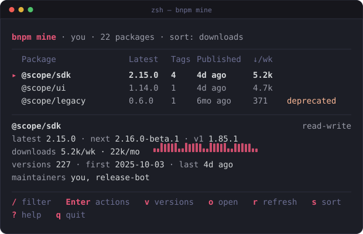

<p align="center">
  
</p>

<p align="center">
  <a href="https://www.npmjs.com/package/@jackchuka/bnpm"></a>
  <a href="https://github.com/jackchuka/bnpm/actions/workflows/ci.yml"></a>
  
  <a href="LICENSE"></a>
</p>

<table align="center">
  <tr>
    <td width="50%">
      
    </td>
    <td width="50%">
      
    </td>
  </tr>
</table>

## Why

You type `npm run` and get a wall of script names. You type `npm deprecate` and get a usage error, then go look up the syntax, then go look up which version you meant. You want to know which of your 22 published packages are dead, and npm has no command for that at all.

bnpm sits in front of npm or pnpm, whichever the project uses, and fills exactly those gaps. It never reimplements either. Every prompt ends by printing the real command and handing off to the real binary, so output, exit codes, registry config, auth, and 2FA prompts are the package manager's own.

## Install

```sh
npm install -g @jackchuka/bnpm
bnpm alias >> ~/.zshrc             # npm  -> bnpm
bnpm alias pnpm >> ~/.zshrc        # pnpm -> bnpm --pm=pnpm        (optional)
```

Pass a shell name for other shells: `bnpm alias pnpm fish`. To try the publisher layer once without installing:

```sh
npx @jackchuka/bnpm mine
pnpm dlx @jackchuka/bnpm mine
```

Needs Node 22.22 or newer on the 22 line, or 24.15 or newer, and npm 11. pnpm 11.11 or newer if you use the pnpm side. `bnpm alias` knows zsh, bash, sh, fish, nu, and PowerShell.

### Completion

Standing in front of npm must not cost you `npm <TAB>`. In zsh it would: zsh substitutes an alias before it looks a completion up, so `alias npm=bnpm` sends the lookup to `bnpm`, which has no completion, and you get file names. So under zsh `bnpm alias` prints a function instead, which leaves the command word alone, and two lines that lend `bnpm` itself whatever completion the manager has:

```zsh
npm() { bnpm "$@" }
_bnpm() { words[1]=npm; _normal }
(( $+functions[compdef] )) && compdef _bnpm bnpm
```

`_bnpm` rewrites the command word at completion time rather than at startup, so it does not matter whether npm's completion is loaded before or after these lines, and the `$+functions` guard keeps the block harmless above `compinit`. Alias both managers and each of `npm <TAB>` and `pnpm <TAB>` still gets its own completion; bare `bnpm <TAB>` gets whichever of the two you installed last.

The other shells keep a plain alias. bash looks completions up under the word you typed, and fish's `alias` is already a function, which autoloads npm's completions by name. Nushell expands aliases before its external completer sees them ([nushell#6378](https://github.com/nushell/nushell/issues/6378)) and PowerShell does not carry a native command's completions across an alias ([PowerShell#21609](https://github.com/PowerShell/PowerShell/issues/21609)); on both, completion for the aliased name needs the same workaround any other alias needs there.

## What the alias changes

Nothing, unless three things are true at once: you are in a terminal, the subcommand is one bnpm knows, and the arguments npm needs are missing. Then you get a prompt instead of an error. Asking for help is never one of those cases: `-h` or `--help` on any command prints the manager's own help. There are two kinds of prompt.

**Project layer**, built from `package.json` and `node_modules`:

| You type                     | Instead of an error you get                                                  |
| ---------------------------- | ---------------------------------------------------------------------------- |
| `npm run`                    | fuzzy pick from `package.json` scripts, Enter runs it                        |
| `npm uninstall`, `npm rm`    | multi-select of installed dependencies, dev and optional marked              |
| `npm update`, `npm outdated` | outdated packages with current, wanted, latest; majors in red; pick a target |
| `npm exec`, `npm x`          | a bin from `node_modules/.bin` plus optional args; npm's own shell is first  |
| `npm link`, `npm ln`         | a globally linked package to link here; linking this package is first        |

**Publisher layer**, built from your registry account. Every picker lists existing choices and also accepts a typed value, validated before it reaches npm:

| You type                           | You get                                                                                                      |
| ---------------------------------- | ------------------------------------------------------------------------------------------------------------ |
| `npm deprecate`                    | your packages or any name → published versions or a range like `<2.0.0` → message → confirm                  |
| `npm dist-tag`                     | your packages or any name → `ls` (npm's default), `add` with existing tags or a new one, `rm`                |
| `npm owner`, `npm owner add`       | your package → current owners shown → add a username, or remove a maintainer when someone else is listed     |
| `npm access`, `npm access set`     | your package → current status shown → the other status first → confirm                                       |
| `npm view`, `npm info`             | the current package first (npm's default), then this project's dependencies, then your packages, or any name |
| `npm docs`, `npm repo`, `npm bugs` | the same picker, then the browser opens the homepage, repository, or issue tracker                           |

### `bnpm -i`

`bnpm -i` (or `--interactive`) lists the commands bnpm prompts for and drops you into the one you pick, so you do not have to remember which ones it improves. The list is only what applies here: the project commands appear when there is a `package.json`, and `update` is left out under pnpm, which ships its own `update -i`. Picking an entry is exactly the same as typing it.

Neither manager claims `-i` at the top level — npm has no such shorthand and pnpm rejects it — so nothing is taken away. It only means the menu on its own: `npm install -i` is still npm's.

### pnpm

bnpm detects the project's manager: the `packageManager` field in the nearest `package.json` first, then `pnpm-lock.yaml` or `package-lock.json`. Inside a pnpm project, plain `bnpm install` runs `pnpm install`, and so does `npm install` if you have the alias. Outside any project it defaults to npm. `--pm=pnpm` or `BNPM_PM=pnpm` overrides detection, and `BNPM_PM=npm` pins npm.

Under pnpm, `run`, `remove`, `exec`, `view`, `docs`, `repo`, `bugs`, `deprecate`, `dist-tag`, and `mine` prompt exactly as they do under npm. `update` and `outdated` pass straight through, since pnpm ships `pnpm update -i`. `link` and `unlink` get pnpm-shaped pickers: bare `pnpm link` is an error (it takes a path, with no global link registry), so bnpm offers the sibling directories of the project that hold a `package.json`, or a typed path. Bare `pnpm unlink` drops every linked dependency, so bnpm lists them from `pnpm ls` with "unlink everything" first; under npm `unlink` stays what it is there, an alias of `uninstall`. pnpm 11.11 or newer is assumed, which is when `view`, `dist-tag`, `owner`, `access`, `bugs`, and `repo` all exist.

Writes run through pnpm for deprecate, undeprecate, dist-tag, unpublish, and view. Owners and access run through npm when it is installed, because pnpm 11.27 and 12.4 both fail against registry.npmjs.org for those two (`owner ls` reports every package as not found, `access get status` gets a 405). With pnpm alone those two actions are hidden. pnpm has no `--dry-run` on any registry command, so the `d` key is not offered there. Bare `pnpm bugs` on a package with no `bugs` or `repository` field is an error in pnpm; npm falls back to the npmjs.com page.

The alias carries the flag because a shell alias cannot change what bnpm sees as its own name. `BNPM_PM=pnpm` in the environment does the same thing.

After picking a package for `view`, a second prompt offers terminal (the default), npmjs.com, repository, or homepage.

Where npm already has a no-argument behavior (`view` and `dist-tag` act on the current package, `exec` opens a shell, `link` links the current package globally), that behavior is the first option, so Enter does what npm would have done.

Everything else passes straight through: any other command, any command that already has its arguments, any help flag, and anything not attached to a terminal. Pipes, editor integrations, and `npm` calls made by other tools all reach the real npm untouched, and so do the scripts npm itself spawns, because a shell alias is never inherited by child processes. CI is detected explicitly too: when `CI`, `GITHUB_ACTIONS`, `GITLAB_CI`, `BUILDKITE`, `CIRCLECI`, `TF_BUILD`, or `JENKINS_URL` is set, or `TERM=dumb`, bnpm never prompts even if a pseudo-terminal is attached.

Escape hatches when you want npm's own behavior in a terminal:

```sh
npm run --plain        # this call only
export BNPM_PLAIN=1    # this shell session
bnpm --bnpm-help       # bnpm's own help; plain --help goes to the manager
bnpm --bnpm-version
```

## `npm mine`

A terminal UI for the packages your account can publish. The list comes from the registry's own record of your access, so it includes packages you maintain but did not author. Rows render immediately from that list and fill in as packuments and download counts arrive.

**Columns**: latest version, dist-tag count, last publish, weekly downloads, and a flag when the latest version is deprecated. The detail pane adds every dist-tag, a 30-day download sparkline, version count, first and last publish, maintainers, and the package's visibility once the Access action has looked it up.

When the registry rejects your credentials the list cannot load at all, so the screen says so and `l` hands off to `npm login` (or `pnpm login`, against the configured registry). bnpm steps aside while it runs, exactly as it does for a 2FA prompt, then reloads.

Download counts come from api.npmjs.org, which rate-limits per client. When it refuses, the column shows `?` and the status line says why, for example `downloads unavailable: rate limited by api.npmjs.org (429), try again in a minute · R to retry`.

**Keys**

| Key               | Action                                                     |
| ----------------- | ---------------------------------------------------------- |
| `j` `k` or arrows | move; `g` and `G` jump to top and bottom                   |
| `/`               | filter by name, substring or fuzzy                         |
| `s`               | cycle sort: name, published, downloads, deprecated first   |
| `Enter`           | action menu for the package                                |
| `v`               | version list; Enter on a version opens a menu scoped to it |
| `o`               | open on npmjs.com                                          |
| `r`               | refresh the row                                            |
| `R`               | retry missing download counts                              |
| `l`               | log in, when the registry rejected your credentials        |
| `?` `q`           | help, quit                                                 |

**Actions**: deprecate, undeprecate, dist-tag ls, add and rm, owner add and rm, access public or private, view, open, unpublish. Menus only show what applies: undeprecate appears only when a version is deprecated, owner rm only when another maintainer exists, access shows the current status and offers the other one first, and read-only packages get view and open. Version, tag, and username pickers accept a typed value alongside the existing choices, so `<2.0.0` or a brand-new tag work without leaving the prompt.

Every write ends on a confirm screen with the exact command:

```
 @scope/legacy › Deprecate › 0.6.0 › Use @scope/sdk instead › confirm
 $ npm deprecate @scope/legacy@0.6.0 "Use @scope/sdk instead"
 Enter run · d dry-run · Esc back
```

Enter runs it. `d` adds `--dry-run` where npm supports it (deprecate, undeprecate, unpublish). Unpublish additionally requires typing the package name. The TUI steps aside while npm runs so a 2FA prompt works normally, then comes back with the result and a refreshed row.

When stdout is not a terminal, or with `--plain` or `--json`, `bnpm mine` prints a tab-separated table or JSON instead:

```sh
bnpm mine | column -ts $'\t'
bnpm mine --json | jq '.[] | select(.latestDeprecated) | .name'
```

## Guarantees

- **Argument fidelity.** Pass-through forwards argv byte for byte. bnpm never parses npm's flags.
- **Exit codes and signals.** npm's exit code is bnpm's exit code. Ctrl-C reaches npm.
- **Auth and registry.** Read via npm's own config loader, so `.npmrc`, environment overrides, project config, and scoped registries (`@scope:registry`) behave as they do in npm. Under pnpm, `pnpm config list` is consulted as well, so a registry set in `pnpm-workspace.yaml` or pnpm's global config wins, and tokens pnpm holds are read through `pnpm config get`. Tokens never leave the machine except in requests to your configured registry.
- **Other registries.** Download counts and "open on npmjs.com" only exist for registry.npmjs.org; against any other registry the counts are left blank and the browser option is hidden. The package list and visibility markers use npmjs endpoints (`/-/user/:user/package`, `/-/package/:name/visibility`); a registry that lacks them shows what it can.
- **No hidden writes.** Reads go to the registry directly. Every write is an `npm …` or `pnpm …` command shown to you first, and the confirm line names the binary.
- **Cost.** The pass-through path loads no UI code. Measured overhead is about 25 ms over bare `npm --version`.

## How it finds npm and pnpm

bnpm walks `PATH` for an `npm` or `pnpm` whose real path is not bnpm itself, so it also works when installed as a symlink named `npm`. For npm it falls back to `npm_execpath`. Which one it looks for follows the precedence in the pnpm section: `--pm`, then `BNPM_PM`, then the project's `packageManager` field or lockfile, then npm.

## Development

```sh
npm ci
npm run dev -- run          # build, then run bnpm with the given args
npm test
npm run check               # typecheck, lint, test, build
```

TypeScript 7, bundled with tsdown, tested with vitest. Prompts are rendered on `@clack/core`; the `mine` screen is Ink. Both draw from one palette in `src/ui/colors.ts`, the same one `assets/generate.mjs` builds the README artwork from. Releases publish from GitHub Actions with npm trusted publishing and provenance.

## Contributing

Issues and pull requests are welcome. See [CONTRIBUTING.md](CONTRIBUTING.md) for setup, scope, and what the tests guarantee.

## License

MIT
